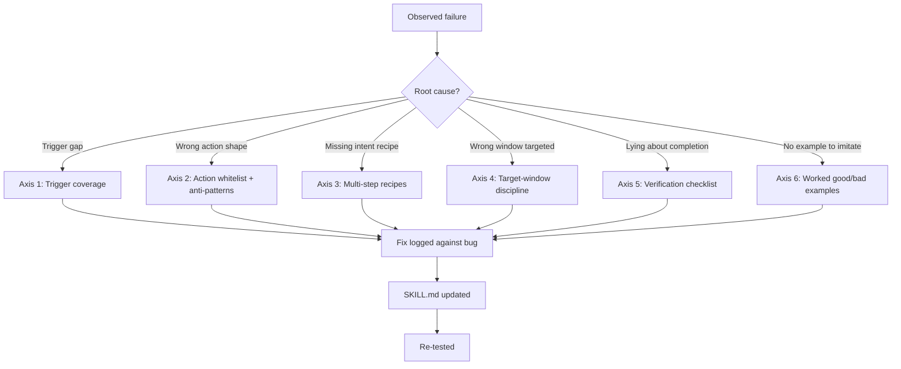

# Agent Reliability Notes

**Failure modes and design patterns observed while building agentic LLM systems.**

*Notes are open; the underlying codebase is private. The purpose of this
repository is to make a set of research observations citable.*

> **Maintainer:** Syeda Alishba Fatima · NCHD, Karachi, Pakistan
> **Contact:** alishbafatima25@gmail.com
> **Status:** Active research log · last updated May 2026

---

## Why this repository exists

I am preparing for a PhD on the reliability of large-language-model
agentic systems, with a specific focus on calibrated abstention. Over
the past two years I have built three agentic LLM systems and have
observed a recurring failure pattern that engineering fixes only
partially address. These notes document that pattern, the design
pattern I introduced in response, and the open research questions the
pattern leaves unresolved.

These observations are not claimed to be unique discoveries. They are
claimed to be real, reproducible in my development environment, and
research-relevant. The purpose of publishing them here is to make them
citable from PhD application materials and to invite correction.

---

## The system under study: BeepSME

BeepSME is an in-development desktop AI agent. The full codebase,
roadmap, and deployment plans are private. What is documented here is
the research-relevant architecture and the observations it has
produced.

### Architecture at a glance

```
                  ┌────────────────────────────────────────┐
                  │            Single LLM instance         │
                  │  (routed across 16 skill specifications)│
                  └───────────────┬────────────────────────┘
                                  │
                ┌─────────────────┼─────────────────┐
                │                 │                 │
        ┌───────▼──────┐  ┌──────▼───────┐  ┌──────▼───────┐
        │ Voice input  │  │ Screen vision│  │ Persistent   │
        │  (speech)    │  │  (perception)│  │   memory     │
        └──────────────┘  └──────────────┘  └──────────────┘
                                  │
                  ┌───────────────▼────────────────┐
                  │   Skill router (16 domains)    │
                  │   Each skill = SKILL.md spec   │
                  └───────────────┬────────────────┘
                                  │
                  ┌───────────────▼────────────────┐
                  │   Verification gate (heuristic)│
                  └───────────────┬────────────────┘
                                  │
                          ┌───────▼────────┐
                          │     Action     │
                          └────────────────┘
```

Three properties of the architecture matter for the observations
below:

- **Single LLM, multiple skills.** A single foundation-model instance
  is routed across sixteen skill domains. Routing is by skill
  specification, not by model. There is no multi-agent orchestration.
- **Voice + vision + persistent memory.** The agent receives voice
  input, can read the screen via vision, and maintains a persistent
  knowledge store across sessions.
- **Skills as constraint specifications.** Each of the sixteen skill
  domains is defined by a SKILL.md specification that constrains what
  the LLM can emit when that skill is active.

---

## The core observation

The single most useful observation produced by the system is this:

> **The agent fails most confidently exactly where it should be
> least certain.**

Concretely: on tasks that require several dependent steps, the agent
emits a completion signal after performing only the easiest of those
steps, and then reports success in fluent natural language unrelated
to whether the task was actually done. The fluency of the report and
the correctness of the action are decoupled.

### The two-regime failure

Attempts to engineer this away through structured prompting and
explicit verification gates produce a second failure: the agent
begins deferring on tasks it could in fact handle.

```
                  ┌──────────────────────────────┐
                  │   No verification gates      │
                  │   → Over-confidence regime   │
                  │   "I did it!" (but didn't)   │
                  └──────────────┬───────────────┘
                                 │
                  Add structured │ prompting +
                  verification   │ gates
                                 │
                                 ▼
                  ┌──────────────────────────────┐
                  │   Aggressive verification    │
                  │   → Over-deferral regime     │
                  │   "I can't help" (but could) │
                  └──────────────────────────────┘
```

Tuning the gates aggressively shifts the failure from one regime to
the other; it does not remove it.

Underneath both regimes is the same problem: **the agent has no
calibrated internal signal of its own uncertainty.** A verification
gate is only as good as the uncertainty estimate that triggers it.
Without calibration, the gate is a heuristic, not a guarantee.

This is the observation I would want to study formally in a PhD.

---

## The six-axis skill specification pattern

In response to the failure modes observed during development, I
designed a specification pattern that constrains each SKILL.md along
six axes. The pattern is applied **incrementally** — one fix per
surfaced bug, never as a mass rewrite — and each fix is logged
against the originating failure so that the system accumulates
structured evidence of where and why agentic LLMs fail in practice.



| # | Axis | What it constrains | What failure it catches |
|---|------|---------------------|--------------------------|
| 1 | Trigger coverage | Set of user phrasings that activate the skill | Misrouted requests |
| 2 | Action whitelist + anti-patterns | Action types permitted; specific shapes that fail silently | Silent action errors |
| 3 | Multi-step recipes | Concrete action sequences for top intents | Premature completion |
| 4 | Target-window discipline | Verify focus before any state-changing action | Acting on wrong window |
| 5 | Verification checklist before completion | Required check between final action and completion | Fluent-but-incorrect reports |
| 6 | Paired worked examples (good / bad) | Real failure and success examples as in-context anchors | Hallucinated execution patterns |

### A note on the pattern

The pattern is engineering, not research. What is research-relevant
is what the pattern leaves unsolved: even with all six axes
specified, the verification gate (Axis 5) depends on an uncertainty
signal that is not itself calibrated. The pattern reduces the
frequency of confident-wrong outputs; it does not eliminate them.

---

## Open research questions

Three questions follow directly from the observations above. These
are the questions I want to spend a PhD answering.

### Q1 — Calibrated abstention in multi-step agents

The two-regime failure reduces to a calibration problem at the gate.
What does principled calibration of the triggering signal look like
when the underlying model is a foundation model and the agent is a
multi-step pipeline rather than a single classifier? Existing
work on selective classification (e.g. Rabanser & Papernot, NeurIPS
2025) addresses this for single-step classifiers; the multi-step
agentic case is less developed.

### Q2 — Data attribution for fluent-but-incorrect outputs

When the agent reports success in fluent language unrelated to the
action it took, which subsets of training data are responsible for
the fluency, and which for the action-outcome decoupling? Are the
two attributable to different training-data influences, and if so,
can they be selectively curated through methods such as those of
Grosse et al. and Raffel et al.?

### Q3 — Guarantees on constrained agentic pipelines

Structured prompting and verification gates are practical
interventions. What theoretical guarantees, if any, can be given
for a constrained agentic pipeline whose gate is fed by a
calibrated uncertainty estimate? This connects to the
trustworthy-ML guarantee literature (e.g. Papernot et al. on
"Suitability Filter").

---

## Selected related work

These notes sit in conversation with the following recent papers:

| Paper | Year | Connection to these notes |
|-------|------|---------------------------|
| Rabanser & Papernot, "What Does It Take to Build a Performant Selective Classifier?" | NeurIPS 2025 | Selective classification = the abstention problem stated from the classifier side |
| Papernot et al., "Confidential Guardian: Cryptographically Prohibiting the Abuse of Model Abstention" | ICML 2025 | Abstention in adversarial settings |
| Pouget, Yaghini, Rabanser & Papernot, "Suitability Filter" | ICML 2025 (oral) | Deployment-time evaluation, directly relevant to public-sector deployment |
| O'Brien et al., "Deep Ignorance: Filtering Pretraining Data Builds Tamper-Resistant Safeguards into Open-Weight LLMs" | 2025 | Data curation as a research problem with non-obvious causal structure |
| Sharma et al., "Towards Understanding Sycophancy in Language Models" | ICLR 2024 | Vocabulary for the fluent-but-incorrect failure mode |
| Benton et al., "Sabotage Evaluations for Frontier Models" (Anthropic + Grosse + Duvenaud) | 2024 | Method for studying agent reliability as a research problem rather than an engineering bug |
| Meng et al., "Locating and Editing Factual Associations in GPT" (ROME) | 2022 | Localized factual knowledge — underpinning of targeted unlearning |
| Pawelczyk et al., "Machine Unlearning Fails to Remove Data Poisoning Attacks" | ICLR 2025 | The unlearning-fails-in-subtle-ways line of work |

---

## Two earlier systems (brief)

Before BeepSME, I built two related systems through the Panaversity
Certified Agentic & Robotic AI Engineer programme. They are
mentioned here only for context; they are not the subject of this
repository.

**Teach Me Panel** — a personalised LLM teaching agent on the
Panaversity Agent Factory platform. First system in which I
attacked hallucination through structured prompting and
human-in-the-loop checkpoints. Surfaced the deferral-vs-confidence
trade-off in a tutoring context.

**Personal AI Employee (Digital FTE)** — an agentic system for
autonomous monitoring and decision support, with the same emphasis
on traceability, structured outputs, and auditable state. Test bed
for separating the agent's instruction context from its execution
logic.

---

## Status of this work

- **System.** BeepSME is in active development. The observations
  here are from developer-led testing during development, not from a
  deployed user study.
- **Notes.** These are a research log, updated as failure modes
  surface and the design pattern refines. They are not a paper.
- **Codebase.** Private. This repository is documentation only.

---

## Citation

If these observations are useful to your work:

```bibtex
@misc{fatima2026agentreliability,
  author = {Fatima, Syeda Alishba},
  title  = {Agent Reliability Notes: Failure modes and design
            patterns observed in BeepSME},
  year   = {2026},
  url    = {https://github.com/AlishbaFatima12/agent-reliability-notes}
}
```

---

## About the author

Syeda Alishba Fatima is an Assistant Director at the National
Commission for Human Development (NCHD), Karachi, where she leads
data-driven education and technology initiatives at national scale.
She holds a Gold Medal in MSc Pure Mathematics from the University
of Karachi (1st in Department) and an MS in Computer Science from
NED University. She is preparing applications for PhD entry in
2027.

**Contact:** alishbafatima25@gmail.com
**LinkedIn:** [linkedin.com/in/syeda-alishba-fatima-695711135](https://www.linkedin.com/in/syeda-alishba-fatima-695711135)

---

*Corrections, counter-examples, and pointers to relevant work are
welcome.*
